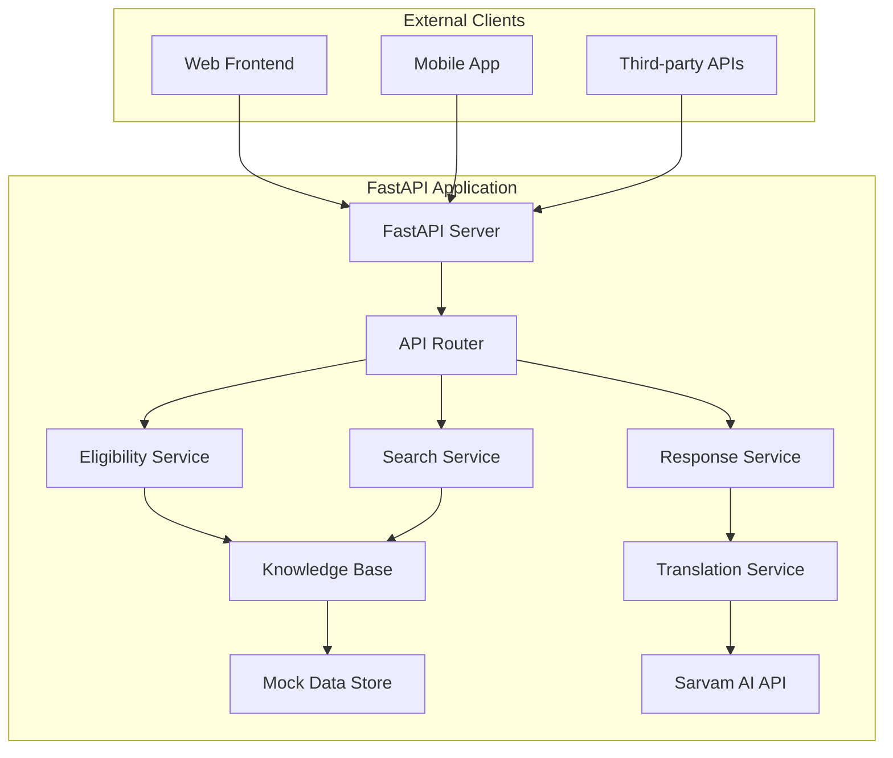

# Technical Design: Databricks to FastAPI Refactor

## Overview

This design document outlines the conversion of the existing Databricks-based Indic Government Scheme Copilot into a standalone FastAPI application. The system will maintain all existing functionality while being deployable outside of the Databricks environment using mock data and simplified dependencies.

The refactored application will provide REST APIs for scheme discovery, eligibility checking, and multilingual response formatting, enabling integration with web and mobile frontends.

## Architecture

### High-Level Architecture



### Component Architecture

The application follows a modular service-oriented architecture with clear separation of concerns:

1. **API Layer**: FastAPI server with REST endpoints
2. **Service Layer**: Business logic for eligibility, search, and response formatting
3. **Data Layer**: In-memory knowledge base with mock data
4. **External Integration Layer**: Sarvam AI for translation and response enhancement

### Technology Stack

- **Web Framework**: FastAPI 0.104+
- **Data Processing**: Pandas, NumPy
- **Vector Operations**: scikit-learn for cosine similarity
- **External APIs**: Sarvam AI for translation
- **Configuration**: Pydantic Settings
- **Validation**: Pydantic models
- **Documentation**: Auto-generated OpenAPI/Swagger

## Components and Interfaces

### 1. FastAPI Server (`main.py`)

**Purpose**: Main application entry point and server configuration

**Key Responsibilities**:
- Application initialization and configuration
- CORS middleware setup
- Health check endpoints
- Graceful startup/shutdown handling

**Interface**:
```python
@app.on_event("startup")
async def startup_event()

@app.on_event("shutdown") 
async def shutdown_event()

@app.get("/health")
async def health_check()
```

### 2. Knowledge Base Service (`services/knowledge_base.py`)

**Purpose**: Manages government scheme data and provides search capabilities

**Key Responsibilities**:
- Load and initialize scheme data from mock sources
- Provide semantic search using pre-computed embeddings
- Filter schemes by category, state, and other criteria
- Maintain in-memory data structures for fast access

**Interface**:
```python
class KnowledgeBaseService:
    def __init__(self, data_path: str)
    def load_schemes(self) -> List[SchemeModel]
    def search_semantic(self, query: str, top_k: int = 5) -> List[SchemeModel]
    def filter_by_category(self, category: str) -> List[SchemeModel]
    def get_scheme_by_id(self, scheme_id: str) -> Optional[SchemeModel]
```

### 3. Eligibility Service (`services/eligibility.py`)

**Purpose**: Matches user profiles against scheme eligibility criteria

**Key Responsibilities**:
- Parse and validate user profile data
- Apply complex eligibility rules (age ranges, income limits, categories)
- Calculate match scores for schemes
- Generate human-readable eligibility reasons
- Provide recommendations for partially matching schemes

**Interface**:
```python
class EligibilityService:
    def check_eligibility(self, user_profile: UserProfile, schemes: List[SchemeModel]) -> List[EligibleScheme]
    def calculate_match_score(self, user_profile: UserProfile, scheme: SchemeModel) -> float
    def generate_eligibility_reason(self, user_profile: UserProfile, scheme: SchemeModel) -> str
    def get_recommendations(self, user_profile: UserProfile, max_results: int = 5) -> List[SchemeModel]
```

### 4. Search Service (`services/search.py`)

**Purpose**: Provides semantic search capabilities for scheme discovery

**Key Responsibilities**:
- Generate query embeddings using mock embedding service
- Calculate cosine similarity with scheme embeddings
- Combine semantic similarity with eligibility matching
- Return ranked results with similarity scores

**Interface**:
```python
class SearchService:
    def __init__(self, knowledge_base: KnowledgeBaseService)
    def semantic_search(self, query: str, user_profile: Optional[UserProfile] = None, top_k: int = 5) -> List[SearchResult]
    def generate_query_embedding(self, query: str) -> List[float]
    def calculate_similarity(self, query_embedding: List[float], scheme_embedding: List[float]) -> float
```

### 5. Response Service (`services/response.py`)

**Purpose**: Formats scheme information into user-friendly responses with translation

**Key Responsibilities**:
- Generate natural language explanations of schemes
- Format eligibility criteria and document requirements
- Provide multilingual support (English/Hindi)
- Handle fallback responses when external services fail

**Interface**:
```python
class ResponseService:
    def format_schemes(self, schemes: List[EligibleScheme], language: str = "english") -> str
    def translate_response(self, text: str, target_language: str) -> str
    def generate_scheme_explanation(self, scheme: SchemeModel, language: str) -> str
```

### 6. Configuration Service (`config.py`)

**Purpose**: Manages application configuration and environment variables

**Key Responsibilities**:
- Load configuration from environment variables
- Provide default values and validation
- Manage API keys and external service settings

**Interface**:
```python
class Settings(BaseSettings):
    app_name: str = "Government Scheme Copilot"
    host: str = "0.0.0.0"
    port: int = 8000
    sarvam_api_key: Optional[str] = None
    similarity_threshold: float = 0.3
    max_results: int = 10
```

## Data Models

### Core Data Models

```python
class UserProfile(BaseModel):
    age: int = Field(..., ge=0, le=120)
    income: float = Field(..., ge=0)
    category: str = Field(..., regex="^(General|OBC|SC|ST|Minority)$")
    occupation: str
    state: str = "Karnataka"

class EligibilityModel(BaseModel):
    age: str  # e.g., "18-25", "60+", "All"
    income: str  # e.g., "< 5 lakh", "BPL families", "All"
    category: str
    occupation: str

class SchemeModel(BaseModel):
    id: str
    name: str
    description: str
    eligibility: EligibilityModel
    documents: List[str]
    state: str
    category: str
    keywords: str
    embedding: Optional[List[float]] = None

class EligibleScheme(BaseModel):
    scheme: SchemeModel
    match_score: float
    eligibility_reason: str
    is_eligible: bool

class SearchResult(BaseModel):
    scheme: SchemeModel
    similarity_score: float
    combined_score: Optional[float] = None
```

### API Request/Response Models

```python
class EligibilityRequest(BaseModel):
    user_profile: UserProfile
    language: str = "english"

class SearchRequest(BaseModel):
    query: str
    user_profile: Optional[UserProfile] = None
    top_k: int = Field(default=5, ge=1, le=20)
    language: str = "english"

class SchemeResponse(BaseModel):
    status: str
    schemes: List[EligibleScheme]
    total_count: int
    metadata: Dict[str, Any]
```

## Mock Data Implementation

### Data Structure

The mock data will replicate the original Databricks Delta Lake schema while being stored in-memory:

```python
# data/schemes.json
{
    "schemes": [
        {
            "id": "pm-scholarship-001",
            "name": "PM Scholarship Scheme",
            "description": "Financial assistance for students pursuing higher education",
            "eligibility": {
                "age": "18-25",
                "income": "< 6 lakh",
                "category": "All",
                "occupation": "student"
            },
            "documents": ["Aadhaar", "Income Certificate", "Marksheet"],
            "state": "Central",
            "category": "education",
            "keywords": "student scholarship education higher",
            "embedding": [0.1, 0.2, ..., 0.8]  # 384-dimensional mock embedding
        }
    ]
}
```

### Embedding Strategy

Since we cannot use Databricks Foundation Models, we'll implement a mock embedding service:

1. **Pre-computed Embeddings**: Store mock embeddings in the JSON data
2. **Simple Embedding Generation**: Use TF-IDF or basic text hashing for new queries
3. **Similarity Calculation**: Implement cosine similarity using NumPy/scikit-learn

```python
class MockEmbeddingService:
    def __init__(self):
        self.vectorizer = TfidfVectorizer(max_features=384, stop_words='english')
        self.fitted = False
    
    def generate_embedding(self, text: str) -> List[float]:
        if not self.fitted:
            # Fit on scheme descriptions during initialization
            self.fit_on_schemes()
        
        vector = self.vectorizer.transform([text])
        return vector.toarray()[0].tolist()
```

### Data Categories

The mock data will include 30+ schemes across categories:
- Education (scholarships, skill development)
- Health (insurance, maternal care)
- Agriculture (farmer support, crop insurance)
- Housing (affordable housing, rural housing)
- Employment (job training, entrepreneurship)
- Social Welfare (pensions, food security)
- Women Empowerment (SHG support, girl child schemes)

## API Specifications

### REST Endpoints

#### 1. Health Check
```
GET /health
Response: {"status": "healthy", "timestamp": "2024-01-01T00:00:00Z"}
```

#### 2. Get All Schemes
```
GET /api/schemes?category={category}&state={state}&limit={limit}
Response: {
    "status": "success",
    "schemes": [...],
    "total_count": 30,
    "filters_applied": {...}
}
```

#### 3. Check Eligibility
```
POST /api/eligibility
Request: {
    "user_profile": {
        "age": 22,
        "income": 400000,
        "category": "General",
        "occupation": "student",
        "state": "Karnataka"
    },
    "language": "english"
}
Response: {
    "status": "success",
    "eligible_schemes": [...],
    "recommended_schemes": [...],
    "user_profile": {...}
}
```

#### 4. Semantic Search
```
POST /api/search
Request: {
    "query": "student scholarship for engineering",
    "user_profile": {...},  // optional
    "top_k": 5,
    "language": "english"
}
Response: {
    "status": "success",
    "results": [...],
    "query": "student scholarship for engineering",
    "similarity_threshold": 0.3
}
```

#### 5. Format Response
```
POST /api/format
Request: {
    "schemes": [...],
    "language": "hindi"
}
Response: {
    "status": "success",
    "formatted_response": "...",
    "language": "hindi"
}
```

### Error Handling

All endpoints will return consistent error responses:

```json
{
    "status": "error",
    "error_code": "INVALID_INPUT",
    "message": "Age must be between 0 and 120",
    "details": {...},
    "timestamp": "2024-01-01T00:00:00Z"
}
```

HTTP Status Codes:
- 200: Success
- 400: Bad Request (validation errors)
- 404: Not Found
- 500: Internal Server Error
- 503: Service Unavailable (external API failures)

## Vector Search Implementation

### Embedding Generation

Since we cannot use Databricks Foundation Models, we'll implement a lightweight alternative:

```python
class MockVectorSearch:
    def __init__(self):
        self.embedding_dim = 384  # Reduced from 1024 for efficiency
        self.schemes_embeddings = {}
        
    def load_scheme_embeddings(self, schemes: List[SchemeModel]):
        """Load pre-computed embeddings for all schemes"""
        for scheme in schemes:
            if scheme.embedding:
                self.schemes_embeddings[scheme.id] = np.array(scheme.embedding)
    
    def generate_query_embedding(self, query: str) -> np.ndarray:
        """Generate embedding for search query using TF-IDF"""
        # Simplified embedding generation
        words = query.lower().split()
        embedding = np.random.random(self.embedding_dim)  # Mock implementation
        return embedding
    
    def search(self, query: str, top_k: int = 5, min_similarity: float = 0.3) -> List[SearchResult]:
        """Perform semantic search using cosine similarity"""
        query_embedding = self.generate_query_embedding(query)
        
        results = []
        for scheme_id, scheme_embedding in self.schemes_embeddings.items():
            similarity = cosine_similarity([query_embedding], [scheme_embedding])[0][0]
            
            if similarity >= min_similarity:
                results.append({
                    'scheme_id': scheme_id,
                    'similarity_score': float(similarity)
                })
        
        # Sort by similarity and return top K
        results.sort(key=lambda x: x['similarity_score'], reverse=True)
        return results[:top_k]
```

### Similarity Calculation

```python
from sklearn.metrics.pairwise import cosine_similarity
import numpy as np

def calculate_cosine_similarity(vec1: List[float], vec2: List[float]) -> float:
    """Calculate cosine similarity between two vectors"""
    vec1_np = np.array(vec1).reshape(1, -1)
    vec2_np = np.array(vec2).reshape(1, -1)
    
    similarity = cosine_similarity(vec1_np, vec2_np)[0][0]
    return float(similarity)
```

## Multilingual Support Integration

### Sarvam AI Integration

The response service will integrate with Sarvam AI for translation and natural language generation:

```python
class SarvamAIService:
    def __init__(self, api_key: str):
        self.api_key = api_key
        self.llm_url = "https://api.sarvam.ai/v1/chat/completions"
        self.translate_url = "https://api.sarvam.ai/translate"
    
    async def generate_response(self, schemes: List[SchemeModel], language: str) -> str:
        """Generate user-friendly response using Sarvam AI LLM"""
        prompt = self._build_prompt(schemes, language)
        
        payload = {
            "model": "sarvam-m",
            "messages": [
                {"role": "system", "content": "You are a helpful assistant explaining Indian government schemes."},
                {"role": "user", "content": prompt}
            ],
            "temperature": 0.7,
            "max_tokens": 1000
        }
        
        headers = {
            "Authorization": f"Bearer {self.api_key}",
            "Content-Type": "application/json"
        }
        
        async with httpx.AsyncClient() as client:
            response = await client.post(self.llm_url, json=payload, headers=headers)
            
        if response.status_code == 200:
            result = response.json()
            return result['choices'][0]['message']['content']
        else:
            # Fallback to basic formatting
            return self._format_basic_response(schemes)
    
    async def translate_text(self, text: str, target_language: str) -> str:
        """Translate text using Sarvam AI Translation API"""
        payload = {
            "input": text,
            "source_language_code": "en-IN",
            "target_language_code": f"{target_language}-IN",
            "speaker_gender": "Male",
            "mode": "formal",
            "model": "mayura:v1",
            "enable_preprocessing": True
        }
        
        headers = {
            "api-subscription-key": self.api_key,
            "Content-Type": "application/json"
        }
        
        async with httpx.AsyncClient() as client:
            response = await client.post(self.translate_url, json=payload, headers=headers)
            
        if response.status_code == 200:
            result = response.json()
            return result.get('translated_text', text)
        else:
            return text  # Return original text if translation fails
```

### Language Support

The application will support:
- **English**: Default language, no translation needed
- **Hindi**: Using Sarvam AI translation API
- **Extensible**: Framework ready for Tamil, Telugu, Bengali, etc.

### Fallback Strategy

When external translation services fail:
1. Return response in English with error message
2. Use pre-translated templates for common responses
3. Log translation failures for monitoring

## Performance Optimization

### In-Memory Data Structures

```python
class OptimizedKnowledgeBase:
    def __init__(self):
        self.schemes_by_id = {}  # O(1) lookup by ID
        self.schemes_by_category = defaultdict(list)  # O(1) category filtering
        self.schemes_by_state = defaultdict(list)  # O(1) state filtering
        self.embedding_matrix = None  # NumPy array for vectorized operations
        
    def load_schemes(self, schemes: List[SchemeModel]):
        """Load schemes into optimized data structures"""
        embeddings = []
        
        for scheme in schemes:
            self.schemes_by_id[scheme.id] = scheme
            self.schemes_by_category[scheme.category].append(scheme)
            self.schemes_by_state[scheme.state].append(scheme)
            
            if scheme.embedding:
                embeddings.append(scheme.embedding)
        
        # Create embedding matrix for vectorized similarity calculations
        self.embedding_matrix = np.array(embeddings)
    
    def fast_similarity_search(self, query_embedding: np.ndarray, top_k: int = 5) -> List[Tuple[int, float]]:
        """Vectorized similarity calculation for all schemes"""
        if self.embedding_matrix is None:
            return []
        
        # Calculate similarities for all schemes at once
        similarities = cosine_similarity([query_embedding], self.embedding_matrix)[0]
        
        # Get top K indices and scores
        top_indices = np.argsort(similarities)[::-1][:top_k]
        top_scores = similarities[top_indices]
        
        return list(zip(top_indices, top_scores))
```

### Caching Strategy

```python
from functools import lru_cache
import hashlib

class CachedResponseService:
    def __init__(self, max_cache_size: int = 1000):
        self.response_cache = {}
        self.max_cache_size = max_cache_size
    
    def _generate_cache_key(self, schemes: List[SchemeModel], language: str) -> str:
        """Generate cache key from schemes and language"""
        scheme_ids = sorted([s.id for s in schemes])
        key_data = f"{'-'.join(scheme_ids)}-{language}"
        return hashlib.md5(key_data.encode()).hexdigest()
    
    async def get_cached_response(self, schemes: List[SchemeModel], language: str) -> Optional[str]:
        """Get cached response if available"""
        cache_key = self._generate_cache_key(schemes, language)
        return self.response_cache.get(cache_key)
    
    async def cache_response(self, schemes: List[SchemeModel], language: str, response: str):
        """Cache response with LRU eviction"""
        if len(self.response_cache) >= self.max_cache_size:
            # Remove oldest entry (simple FIFO, could be improved to LRU)
            oldest_key = next(iter(self.response_cache))
            del self.response_cache[oldest_key]
        
        cache_key = self._generate_cache_key(schemes, language)
        self.response_cache[cache_key] = response
```

### Concurrent Request Handling

FastAPI's async support will handle concurrent requests efficiently:

```python
@app.post("/api/search")
async def search_schemes(request: SearchRequest) -> SearchResponse:
    """Handle concurrent search requests"""
    # All operations are async and non-blocking
    results = await search_service.semantic_search(
        query=request.query,
        user_profile=request.user_profile,
        top_k=request.top_k
    )
    
    return SearchResponse(
        status="success",
        results=results,
        query=request.query
    )
```

## Configuration Management

### Environment-Based Configuration

```python
from pydantic import BaseSettings
from typing import Optional

class Settings(BaseSettings):
    # Application Settings
    app_name: str = "Government Scheme Copilot"
    app_version: str = "1.0.0"
    debug: bool = False
    
    # Server Settings
    host: str = "0.0.0.0"
    port: int = 8000
    reload: bool = False
    
    # API Settings
    api_prefix: str = "/api"
    cors_origins: List[str] = ["*"]
    
    # External Services
    sarvam_api_key: Optional[str] = None
    enable_translation: bool = True
    
    # Search Configuration
    similarity_threshold: float = 0.3
    max_search_results: int = 10
    embedding_dimensions: int = 384
    
    # Performance Settings
    cache_size: int = 1000
    request_timeout: int = 30
    
    # Data Settings
    schemes_data_path: str = "data/schemes.json"
    
    class Config:
        env_file = ".env"
        env_prefix = "SCHEME_"

# Usage
settings = Settings()
```

### Configuration Validation

```python
@app.on_event("startup")
async def validate_configuration():
    """Validate configuration on startup"""
    if settings.enable_translation and not settings.sarvam_api_key:
        logger.warning("Translation enabled but no Sarvam API key provided")
    
    if not os.path.exists(settings.schemes_data_path):
        raise FileNotFoundError(f"Schemes data file not found: {settings.schemes_data_path}")
    
    logger.info(f"Configuration validated successfully")
    logger.info(f"App: {settings.app_name} v{settings.app_version}")
    logger.info(f"Debug mode: {settings.debug}")
```

## Error Handling Strategy

### Graceful Degradation

The application will implement graceful degradation for external service failures:

```python
class ResilientResponseService:
    def __init__(self, sarvam_service: SarvamAIService):
        self.sarvam_service = sarvam_service
        self.fallback_templates = self._load_fallback_templates()
    
    async def format_schemes_with_fallback(self, schemes: List[SchemeModel], language: str) -> str:
        """Format schemes with graceful fallback"""
        try:
            # Try Sarvam AI first
            response = await self.sarvam_service.generate_response(schemes, language)
            return response
        except Exception as e:
            logger.warning(f"Sarvam AI failed: {e}, using fallback")
            
            # Fallback to template-based formatting
            return self._format_with_template(schemes, language)
    
    def _format_with_template(self, schemes: List[SchemeModel], language: str) -> str:
        """Fallback formatting using templates"""
        template = self.fallback_templates.get(language, self.fallback_templates['english'])
        
        formatted_schemes = []
        for i, scheme in enumerate(schemes, 1):
            scheme_text = template['scheme_format'].format(
                number=i,
                name=scheme.name,
                description=scheme.description,
                documents=', '.join(scheme.documents)
            )
            formatted_schemes.append(scheme_text)
        
        return template['response_format'].format(
            count=len(schemes),
            schemes='\n\n'.join(formatted_schemes)
        )
```

### Error Response Models

```python
class ErrorResponse(BaseModel):
    status: str = "error"
    error_code: str
    message: str
    details: Optional[Dict[str, Any]] = None
    timestamp: datetime
    request_id: Optional[str] = None

class ErrorCode(str, Enum):
    INVALID_INPUT = "INVALID_INPUT"
    SCHEME_NOT_FOUND = "SCHEME_NOT_FOUND"
    EXTERNAL_SERVICE_ERROR = "EXTERNAL_SERVICE_ERROR"
    INTERNAL_ERROR = "INTERNAL_ERROR"
    RATE_LIMIT_EXCEEDED = "RATE_LIMIT_EXCEEDED"
```

### Exception Handlers

```python
@app.exception_handler(ValidationError)
async def validation_exception_handler(request: Request, exc: ValidationError):
    return JSONResponse(
        status_code=400,
        content=ErrorResponse(
            error_code=ErrorCode.INVALID_INPUT,
            message="Validation failed",
            details={"errors": exc.errors()},
            timestamp=datetime.utcnow()
        ).dict()
    )

@app.exception_handler(HTTPException)
async def http_exception_handler(request: Request, exc: HTTPException):
    return JSONResponse(
        status_code=exc.status_code,
        content=ErrorResponse(
            error_code=ErrorCode.INTERNAL_ERROR,
            message=exc.detail,
            timestamp=datetime.utcnow()
        ).dict()
    )
```

## Correctness Properties

*A property is a characteristic or behavior that should hold true across all valid executions of a system-essentially, a formal statement about what the system should do. Properties serve as the bridge between human-readable specifications and machine-verifiable correctness guarantees.*

### Property 1: Server Initialization Completeness

*For any* valid configuration, when the FastAPI server starts up, all required services (Knowledge Base, Eligibility Engine, Search Service, Response Service) should be properly initialized and accessible.

**Validates: Requirements 1.1, 1.5**

### Property 2: Configuration Consistency

*For any* valid environment configuration, the server should start successfully and all configured values should be applied to their respective services (similarity thresholds, result limits, language settings, external service toggles).

**Validates: Requirements 1.2, 9.1, 9.2, 9.3, 9.4, 9.5**

### Property 3: CORS Header Presence

*For any* HTTP request to the API, the response should include appropriate CORS headers to enable frontend integration.

**Validates: Requirements 1.3**

### Property 4: Semantic Search Consistency

*For any* valid search query, the vector search should generate embeddings of the correct dimensions, calculate cosine similarity values between -1 and 1, and return results filtered by similarity threshold and sorted by relevance score.

**Validates: Requirements 4.1, 4.2, 4.3, 4.5**

### Property 5: Knowledge Base Filtering Accuracy

*For any* filter criteria (category, state, eligibility), the knowledge base should return only schemes that match all specified criteria.

**Validates: Requirements 2.2, 2.5**

### Property 6: Scheme Metadata Completeness

*For any* scheme loaded into the knowledge base, it should contain all required metadata fields (name, description, eligibility criteria, documents, embeddings) with valid data types and non-empty values.

**Validates: Requirements 2.3, 7.2, 7.3**

### Property 7: Eligibility Processing Completeness

*For any* valid user profile, the eligibility engine should parse all profile fields correctly, calculate match scores within the range 0-100, return eligible schemes with explanatory reasons, and provide recommendation scores for partially matching schemes.

**Validates: Requirements 3.1, 3.2, 3.3, 3.4, 3.5**

### Property 8: Combined Search Scoring

*For any* search query with user profile, the vector search should combine semantic similarity scores with eligibility match scores to produce a unified ranking that reflects both relevance and eligibility.

**Validates: Requirements 4.4**

### Property 9: Response Language Consistency

*For any* list of schemes and target language (English/Hindi), the response formatter should generate output in the requested language and include all required document lists in the response.

**Validates: Requirements 5.2, 5.4**

### Property 10: Fallback Response Reliability

*For any* external service failure scenario, the system should provide fallback responses without crashing and maintain basic functionality using local resources.

**Validates: Requirements 5.5, 8.2**

### Property 11: API Response Schema Consistency

*For any* valid API request, the response should follow the consistent JSON schema structure with appropriate HTTP status codes and include all required fields (status, data, metadata).

**Validates: Requirements 6.4, 6.5**

### Property 12: Input Validation and Error Handling

*For any* invalid input parameters, the API should return descriptive error messages with 400 status codes and handle timeout scenarios gracefully without system crashes.

**Validates: Requirements 8.1, 8.4, 8.5**

### Property 13: Response Caching Consistency

*For any* identical request parameters, the response formatter should return cached responses when available, and cache new responses for future use.

**Validates: Requirements 10.5**

## Testing Strategy

The testing strategy will employ both unit tests and property-based tests to ensure comprehensive coverage and correctness.

### Unit Testing Approach

Unit tests will focus on specific examples, edge cases, and integration points:

- **Health Check Endpoint**: Verify `/health` endpoint returns success response
- **API Endpoint Availability**: Test that `/api/eligibility`, `/api/search`, and `/api/schemes` endpoints exist and accept appropriate HTTP methods
- **Data Content Verification**: Verify that mock data includes 30+ schemes, Central and Karnataka schemes, and all expected categories
- **Known Eligibility Scenarios**: Test specific user profiles against known scheme eligibility
- **Translation Service Integration**: Test with mocked Sarvam AI responses
- **Configuration Edge Cases**: Test startup with missing or invalid configuration

### Property-Based Testing Configuration

Property-based tests will verify universal properties across all inputs using the Hypothesis library:

- **Minimum 100 iterations** per property test due to randomization
- Each property test will reference its design document property
- Tag format: **Feature: databricks-to-fastapi-refactor, Property {number}: {property_text}**

### Test Categories

**Unit Tests**:
- Specific API request/response examples
- Known scheme eligibility scenarios  
- Translation service integration points
- Configuration validation edge cases

**Property Tests**:
- Universal properties that hold for all valid inputs
- Comprehensive input coverage through randomization
- System invariants and correctness properties

Both testing approaches are complementary and necessary for comprehensive coverage. Unit tests catch concrete bugs and verify specific behavior, while property tests verify general correctness across the input space.